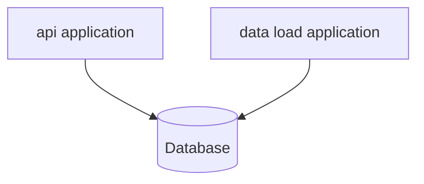

# README
- https://github.com/jk6841/kakao-enterprise

## 시스템 구조

- `api`
    - API 제공하는 서버 application

- `data load`
  - 기초 데이터를 읽어서 RDB에 저장
  - 작업을 마치고 종료되는 short-lived application

## 기술 스택
- Java 21
- Spring Boot(3.5.4)
- Spring Webflux
- Spring Data R2dbc
- `/build.gradle.kts`

## git repository 구조
### `/src`
- source code (gradle 기본 convention)
- package 구조
  - `io.github.jk6841.kakaoenterprise`
    - `api`
      - `api` 애플리케이션에 필요한 클래스들이 모여 있는 package
    - `dataload`
      - `data load` 애플리케이션에 필요한 클래스들이 모여 있는 package
    - `common`
      - `api` 애플리케이션과 `dataload` application이 공유하는 package
  - ```
    이런 경우 api, dataload, common을 gradle module로 분리하는 multi module project로 분리하는 것이 보편적인 방식이지만, 
    전체 기능이 많지 않고 초기 개발 상황이어서 패키지를 분리하고 component scan으로 처리했습니다.
    ```

### `/api.yaml`
- API 스펙 파일

### `/compose.yaml`
- 로컬 실행을 위해 MySQL을 docker compose로 실행하는 파일

### `/ddl.sql`
- DB DDL 파일

## 실행 방법
### MySQL
- ```shell
  docker compose up -d
  ```
  
### DataLoad Application
- ```shell
  gradle dataload-app
  ```
  

### Api Application
- ```shell
  gradle api-app
  ```

## 세부 설명
### 데이터 구조
- table `song`
  - 동일 노래에 속한 artist 별로 분리했습니다.
    - 이유
      - 파일의 artist는 comma-separated로 여러 명의 가수가 포함됨
      - artist가 길면 index 불가능
    - `최종적으로는 정규화 필요하지만, 일단 데이터 중복이 있게 구현했습니다.`
- table `llike`
  - user 별로 중복 좋아요를 막기 위해 (user, song)을 unique하게 설정합니다.

### DataLoad Application 동작 방식
- 파일에서 json line 1줄씩 읽기
- object로 역직렬화
- 여러 row를 모아서 batch insert
  - 한 object(파일 기준 line)별로 insert하면 insert query가 너무 많습니다.
  - batch size는 application property로 설정하여 인프라, DB 상황에 따라 튜닝할 수 있게 구현했습니다.
    - `app.dataload.batch.size`
